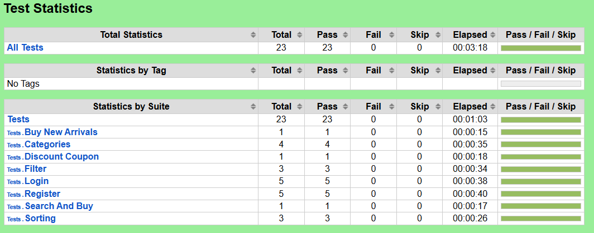

## Book Store
Practice repository for test automation site



Content of suite

View latest report: https://github.com/JJGit55/book_store/blob/main/results/log.html


## How to run content in this reposatory
Create virtual enviroment with

````
python -m venv venv
````

Activate it with Windows

````
venv\Scripts\activate 
````
Or on mac/Linux

````
source venv\bin\activate 
````

Install dependencies with

````
pip install -r requirements.txt
````
Then run

````
rfbrowser init
````

Run tests with command
````
robot -d results ADD_YOUR_TEST_NAME_HERE
````
